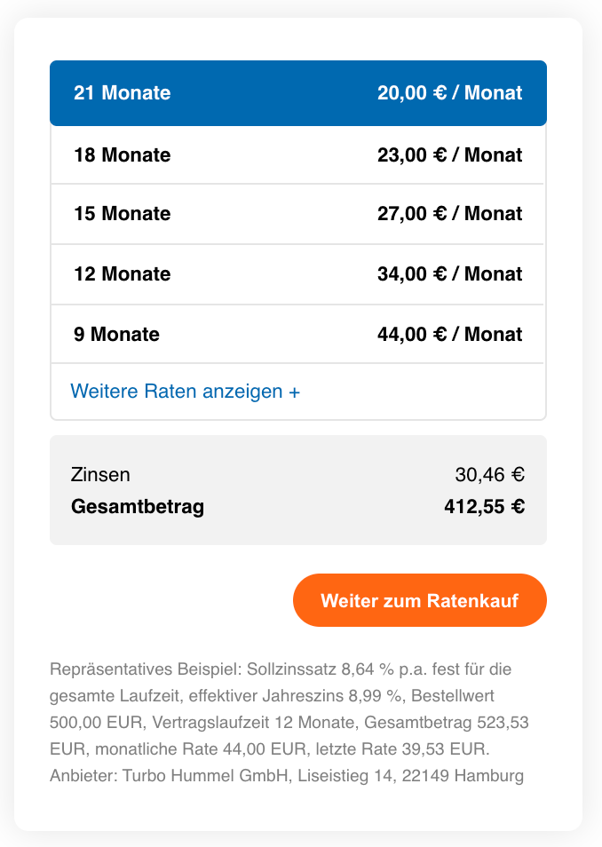

# ratenkauf by easyCredit Web Components

Th ratenkauf by easyCredit Web Components are a set of VueJS web components to be universally used in e-commerce platforms like Magento or Shopware. The web components ease integration of ratenkauf by easyCredit installments payment solution by providing versatile web frontend elements for marketing and checkout.

## Available Elements

### Checkout Label

The Checkout Label component can be used to display ratenkauf by easyCredit as payment method within a list. It is used to display the payment method consistently accross different stores.


```
<easycredit-components-checkout-label>
```

### Checkout

The Checkout component acts as payment form and will usually be shown after the payment method was selected by the user. The user can instantly interact with the payment method and will be asked for further information (e.g. prefix, privacy agreement) prior to being redirected.



```
<easycredit-components-checkout amount="2999" webshop-id="1234">
```

## Project setup
```
yarn install
```

### Compiles and hot-reloads for development
```
yarn serve
```

### Compiles and minifies for production
```
yarn build
```

### Lints and fixes files
```
yarn lint
```
